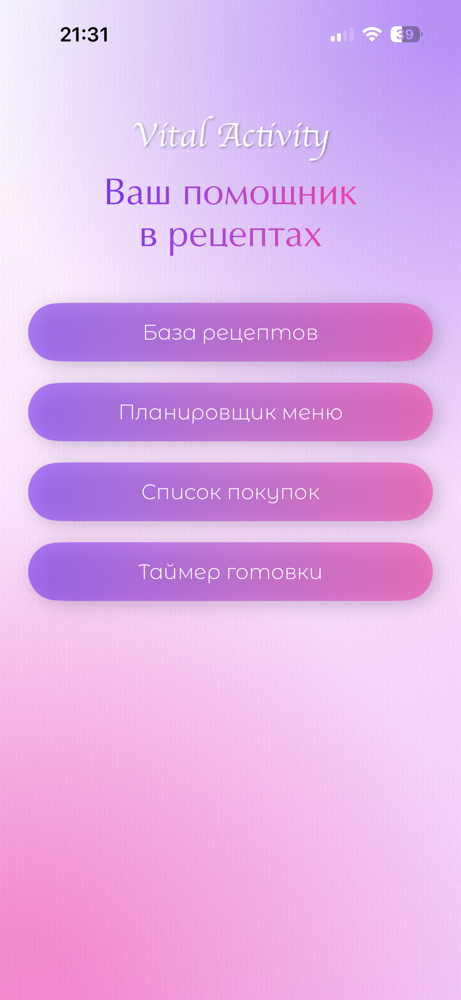
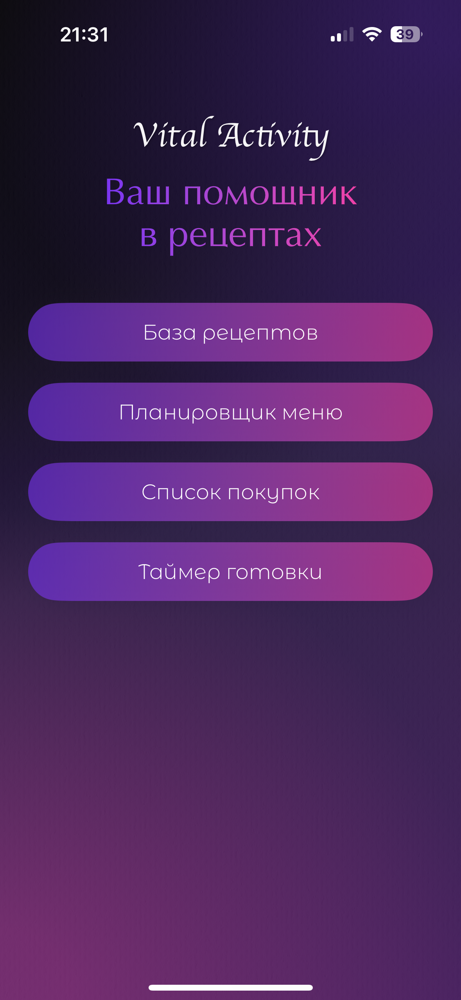
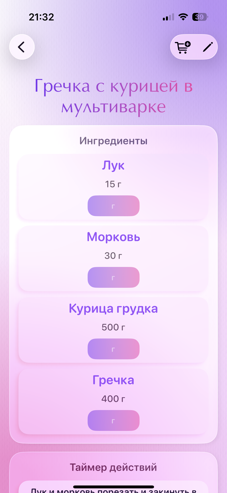
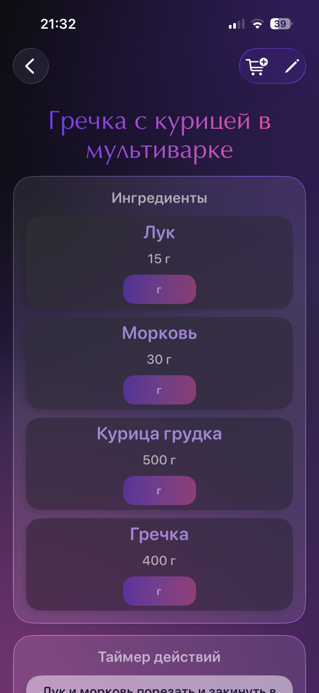
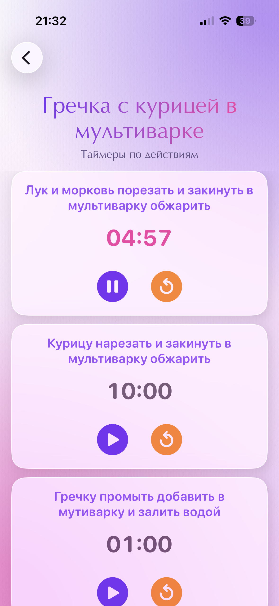
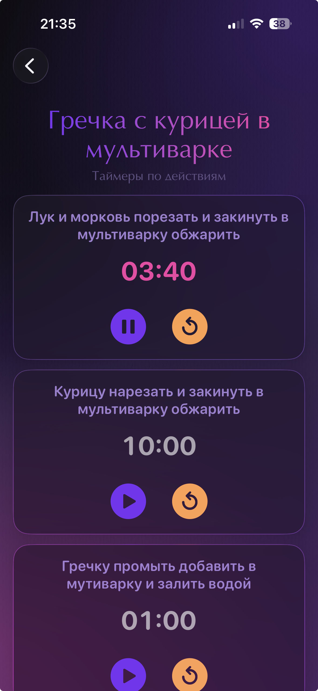

# Recipe App – Приложение для управления рецептами

  

Полнофункциональное iOS-приложение для создания, хранения и приготовления рецептов с интегрированным таймером, планированием питания и локальным хранилищем на Core Data.

## 📱 Основные возможности

- **📖 Каталог рецептов** – просмотр, фильтрация по категориям (завтраки, супы, основные блюда и т.д.)
- **➕ Создание и редактирование** – интуитивный редактор с ингредиентами и пошаговыми инструкциями
- **⏱️ Умный таймер приготовления** – пошаговый таймер с уведомлениями для каждого этапа
- **📅 Планирование питания** – составление меню на неделю с привязкой рецептов
- **🛒 Список покупок** – автоматическое добавление ингредиентов из рецептов, управление покупками, группировка по категориям
- **🔍 Поиск** – поиск по названию, ингредиентам и категориям
- **🎨 Кастомизация** – светлая/тёмная тема, акцентный цвет, кастомные шрифты (6+ шрифтов)
- **📊 Локальное хранение** – все данные сохраняются на устройстве через Core Data
- **📤 Экспорт списка покупок** – возможность поделиться списком покупок через стандартные средства iOS
- **🔄 Объединение дубликатов** – автоматическое объединение повторяющихся ингредиентов в списке покупок
- **📱 Адаптивный интерфейс** – поддержка всех размеров экранов iPhone и iPad

## 🏗️ Архитектура

Приложение построено по гибридной архитектуре **MVVM + Repository Pattern** с использованием современных технологий Apple.

### Слои архитектуры:

1. **Presentation Layer (SwiftUI Views)**
   - `ContentView` – корневой View со сплеш-экраном и навигацией
   - `RecipesBaseView` – главный экран списка рецептов
   - `RecipeDetailView` – детали рецепта с редактированием
   - `CookingTimerViews` – экран таймера приготовления
   - `MenuPlannerViews` – планировщик питания
   - `ShoppingListView` – экран списка покупок с группировкой и управлением

2. **ViewModels & State Management**
   - `ShoppingListViewModel` – ViewModel для управления состоянием списка покупок
   - Использование `@State`, `@StateObject`, `@EnvironmentObject` для управления состоянием
   - Реактивное обновление UI через Combine и Swift Concurrency

3. **Business Logic & Services**
   - `TimerManager` – централизованное управление таймерами (singleton)
   - `ErrorHandler` – обработка и отображение ошибок
   - `NotificationManager` – управление локальными уведомлениями
   - `ShoppingListRepository` – управление данными списка покупок в Core Data

4. **Data Layer (Core Data)**
   - `PersistenceController` – управление Core Data стеком
   - Прямая работа с Core Data сущностями через `NSManagedObjectContext`
   - Сериализация сложных данных через JSON в `CoreDataSupport.swift`

5. **Domain Models**
   - `DomainModels.swift` – Swift-структуры (Ingredient, CookingStep, RecipeCategory, QuantityUnit)
   - `CoreDataSupport.swift` – расширения Core Data сущностей для сериализации
   - `ShoppingItem.swift` – модель данных элемента списка покупок

6. **Infrastructure**
   - `CommonStyles.swift`, `StyleSystem.swift` – система стилей
   - `TextWithLinks.swift` – компоненты UI
   - `ActiveTimerPanel.swift` – компактная панель активного таймера

## 📁 Детальная структура проекта

### Корневые файлы
- **RecipeApp.swift** – точка входа, настройка Core Data и глобального UI
- **ContentView.swift** – корневой View, управление сплеш-экраном и навигацией

### Модели данных
- **DomainModels.swift** – Swift-структуры:
  - `RecipeCategory` – категории рецептов (завтраки, супы и т.д.)
  - `Ingredient` – ингредиент с количеством и единицами измерения
  - `CookingStep` – шаг приготовления с временем
  - `QuantityUnit` – единицы измерения (граммы, ст. ложки, штуки)
  - `UnitConverter` – конвертер между единицами
- **CoreDataSupport.swift** – расширения для `RecipeEntity` и `MealPlanEntity`
- **Recipe.xcdatamodeld** – модель Core Data с сущностями и отношениями
- **ShoppingItem.swift** – модель данных элемента списка покупок

### Хранение данных
- **Persistence.swift** – контроллер Core Data с shared и preview экземплярами
- **ShoppingListRepository.swift** – репозиторий для CRUD операций с элементами списка покупок

### Главные экраны
- **RecipesBaseView.swift** – список рецептов с фильтрацией и поиском

  <strong>Главное меню (светлая и тёмная темы)</strong> 
  
  

  <strong>Список рецептов (светлая и тёмная темы)</strong> 
  
  

- **RecipeDetailView.swift** – полная информация о рецепте, редактирование

  <strong>Меню рецепта (светлая и тёмная темы)</strong> 
  
  

- **AddOrEditRecipeSheet.swift** – форма создания/редактирования рецепта
- **SplashAndMainViews.swift** – сплеш-экран и главное меню

  <strong>Приветственный экран (светлая и тёмная темы)</strong> 
  
  

### Таймер приготовления
- **TimerManager.swift** – управление активными таймерами, уведомлениями
- **CookingTimerViews.swift** – интерфейс таймера с прогрессом и управлением
- **ActiveTimerPanel.swift** – компактная панель активного таймера

  <strong>Таймеры приготовления (светлая и тёмная темы)</strong> 
  
  

### Планирование питания
- **MenuPlannerViews.swift** – недельный планировщик с drag & drop
- **MealPlanPickerSheet.swift** – выбор и создание планов питания

### Список покупок
- **ShoppingListView.swift** – главный экран списка покупок с группировкой по категориям
- **ShoppingListViewModel.swift** – ViewModel для управления состоянием списка покупок
- **ShoppingListRepository.swift** – репозиторий для CRUD операций с элементами покупок

### Вспомогательные компоненты
- **CommonStyles.swift** – общие стили (кнопки, карточки, градиенты)
- **StyleSystem.swift** – система дизайна (цвета, шрифты, тени, отступы)
- **TextWithLinks.swift** – компонент для отображения текста с кликабельными ссылками
- **ErrorHandler.swift** – централизованная обработка ошибок
- **NotificationManager.swift** – управление локальными уведомлениями

### Ресурсы
- **Assets.xcassets** – иконки, цвета, изображения, текстурные фоны
- **Recipe/Fonts/** – кастомные шрифты (Apple Chancery, Montserrat Alternates и др.)

### Тестирование
- **RecipeTests/** – unit-тесты для моделей и конвертеров
- **RecipeUITests/** – UI-тесты основных сценариев

## 🔧 Технологический стек

- **SwiftUI** – декларативный UI фреймворк
- **Core Data** – объектно-графовая база данных с SQLite бэкендом
- **Combine** – реактивное программирование для стримов данных
- **Swift Concurrency** – async/await для асинхронных операций
- **UserNotifications** – локальные уведомления для таймера

## 🚀 Быстрый старт

### Требования
- iOS 17.0+
- Xcode 15.0+
- Swift 5.9+

### Установка
1. Клонируйте репозиторий
2. Откройте `Recipe.xcodeproj` в Xcode
3. Выберите симулятор или подключенное устройство
4. Нажмите `Cmd + R` для запуска

### Конфигурация
- Для работы уведомлений таймера требуется разрешение `UserNotifications`
- Кастомные шрифты автоматически регистрируются при запуске

## 📊 Потоки данных

### Создание рецепта
1. Пользователь нажимает "+" в `RecipesBaseView`
2. Открывается `AddOrEditRecipeSheet`
3. Данные валидируются и сохраняются напрямую через Core Data
4. UI автоматически обновляется через SwiftUI binding

### Запуск таймера
1. В `RecipeDetailView` пользователь нажимает "Начать приготовление"
2. Отправляется уведомление `Notification.Name.openRecipeTimer`
3. `ContentView` перехватывает уведомление и открывает `CookingTimerViews`
4. `TimerManager` создает таймер для каждого шага приготовления
5. По завершению шага отправляется локальное уведомление через `NotificationManager`

### Планирование питания
1. В `MenuPlannerViews` пользователь перетаскивает рецепты на дни недели
2. Изменения сохраняются в `MealPlanEntity` через Core Data
3. При открытии плана отображаются привязанные рецепты

### Работа со списком покупок
1. Пользователь добавляет ингредиенты из рецепта через кнопку "Добавить в список покупок" в `RecipeDetailView`
2. Элементы сохраняются через `ShoppingListRepository` в Core Data
3. В `ShoppingListView` элементы группируются по категориям, можно отмечать купленное
4. При экспорте список преобразуется в текстовый формат и передается в системный UIActivityViewController

## 🧪 Тестирование

### Unit-тесты
- `UnitConverterTests` – тесты конвертера единиц измерения
- Базовые тесты приложения

### UI-тесты
- Основные сценарии: запуск приложения, создание рецепта, таймер, работа со списком покупок

## 🔄 Миграции данных

Приложение поддерживает миграцию данных через версионирование Core Data:
1. При изменении модели данных создается новая версия в `Recipe.xcdatamodeld`
2. Миграция выполняется автоматически с lightweight миграцией

## 📈 Производительность

### Оптимизации
- Эффективная работа с Core Data через `@FetchRequest`
- Группировка элементов списка покупок по категориям для уменьшения нагрузки на UI
- Автоматическое объединение дубликатов при добавлении ингредиентов
- Использование фоновых контекстов для операций записи

## 👥 Командная разработка

### Code Style
- Единый стиль именования: camelCase для переменных, PascalCase для типов
- Комментарии для сложной логики

### Git Workflow
- Feature branches для новой функциональности
- Semantic versioning для тегов релизов

## 📄 Лицензия

Проект создан для портфолио и обучения. Код может свободно использоваться, модифицироваться и распространяться с указанием авторства.

## 🤝 Вклад в проект

1. Форкните репозиторий
2. Создайте feature branch
3. Внесите изменения
4. Добавьте тесты
5. Создайте Pull Request

## 📞 Контакты

По вопросам сотрудничества и предложениям:
- Tel: 8-953-035-2151
- Email: vovova_k@mail.ru
- GitHub: [vovoni5](https://github.com/vovoni5)

---

